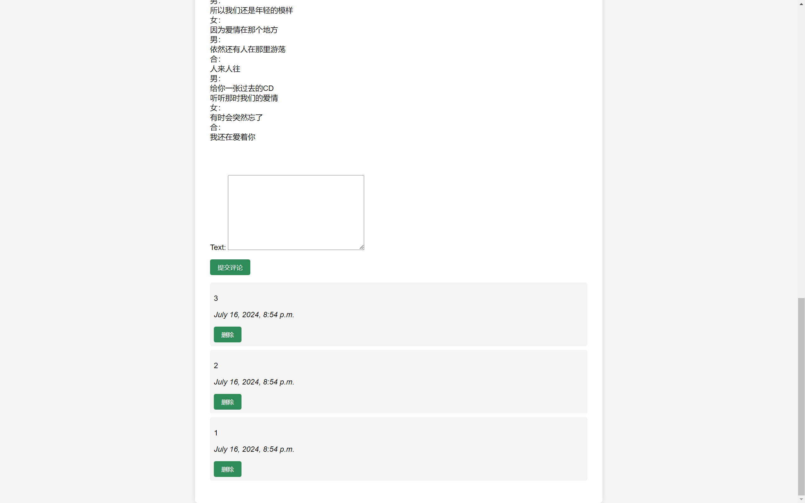

# 爬虫与信息系统 实验报告

万振南 2021030014

## 一、系统功能

### 1. 歌曲列表页


### 2. 歌曲详情页




### 3. 歌手列表页


### 4. 歌手详情页


### 5. 搜索和搜索结果页


## 二、关键技术和算法

### 1. 数据获取和处理

**爬虫技术**

Requests库：用于发送HTTP请求以获取网页内容。

获取歌词：参考了lyric-crawler https://github.com/godweiyang/lyric-crawler

**数据清洗**

字符串处理：使用正则表达式和字符串方法清洗爬取到的数据，如提取歌手名字、歌词、粉丝数量等。

数据标准化：将不同格式的粉丝数量标准化为数值格式。

**JSON处理**

json库：用于读写JSON格式的数据，方便数据的存储和传输。

### 2. Web系统设计

**Django框架**

用于构建网站，实现数据展示和检索功能。包括：

models.py：定义了 Singer 和 Song 模型。

views.py：定义处理用户请求的逻辑，如展示歌手列表、歌曲详情、搜索功能等。

templates：使用Django模板语言生成动态HTML页面，展示歌手和歌曲信息。

**数据存储与管理**

Django ORM：用于与数据库交互，通过ORM将爬取的数据存入数据库。

**高效检索**

全文检索：通过Django的查询集QuerySet实现对歌手和歌曲信息的全文检索。

权重计算：根据关键词在歌曲名、歌手名和歌词中的出现频率，计算匹配的权重，排序后展示结果。

### 3. 数据分析与可视化

**自然语言处理**

Jieba分词：用于对歌词进行中文分词，便于后续的词频统计和词云生成。

停用词过滤：使用停用词列表过滤掉高频但无意义的词语。

**数据分析**

Pandas库：用于数据分析和处理，生成数据表格。

Counter：用于统计词频，找出歌词中的高频词。

**数据可视化**

Matplotlib：用于生成各种数据可视化图表，如歌词长度分布图、歌手粉丝数量分布图等。

WordCloud：用于生成词云，直观展示歌词中的高频词。

## 三、数据介绍

**歌手数据**

QQ音乐内地、港台、欧美、日本、韩国五个地区共400名歌手，每个地区80名。

https://y.qq.com/n/ryqq/singer_list

最后数据格式如下：

```json
singers.json
{
  "singers": [
    {
      "singer_id": "",
      "singer_name": "",
      "image_url": "",
      "bio": "",
      "fans": "",
      "original_url": "",
      "songs": [
        {
          "song_id": "",
          "song_name": "",
          "original_url": "",
          "image_url": ""
        }
      ]
    }
  ]
}
```

**歌曲数据**

上述歌手的约2620首歌曲，每个歌手的歌曲不超过10首。

最后数据格式如下：

```json
songs.json
{
  "songs": [
    {
      "song_id": "",
      "song_name": "",
      "singer_name": "",
      "image_url": "",
      "lyrics": "",
      "original_url": "",
    },
  ]
}
```

## 四、数据分析

### 1. 歌词热词分析

以港台歌手为例，得到词云图如下：


其中热词 top 20 如下：

```text
我们	849
没有	691
一个	576
如果	505
自己	489
音乐	448
什么	448
怎么	410
知道	394
编曲	372
世界	372
爱情	362
永远	357
不会	338
不要	337
还是	334
真的	296
可以	295
维伴	289
那么	285
```

热词中有许多与情感表达相关的词，如“我们” (849次)、“没有” (691次)、“如果” (505次)、“爱情” (362次)、“永远” (357次)，这些词常用于表达爱情、友情等主题。

歌词中常有的疑问与否定词，如“什么” (448次)、“怎么” (410次)、“不会” (338次)、“不要” (337次)，表达了困惑、不满或决心等情感。

还有一些词汇在歌词中是平凡的，例如“音乐”、“编曲”等。“维伴”难以理解，经过分析发现是一家音乐公司的名字，频繁出现在歌词信息中。

**结论：港台歌手的歌词热词 top 5 是 “我们” (849次)、“没有” (691次)、“一个” (576次)、“如果” (505次)、“自己” (489次)，歌曲主要包括情感表达、个人反思、疑问与否定等主题。**

### 2. 歌词长度分析

内地歌手歌词长度分布图：


港台歌手歌词长度分布图：


对比两者分布，可以发现港台歌手平均歌词长度小于内地歌手平均歌词长度。

统计数据也表明，港台歌手平均歌词长度 (525字符) 小于内地歌手平均歌词长度 (659字符)。

**结论：港台歌手平均歌词长度小于内地歌手平均歌词长度**

### 3. 粉丝数量分析

取各个地区前 80 名歌手分析，得到各个地区歌手粉丝数量分布图

内地：

 

港台：

 

欧美：

 

日本：

 

韩国：


可以发现五个地区中，内地和港台拥有更多粉丝。对比内地和港台，内地拥有较多粉丝 (>2e6) 的歌手数量较多，而港台拥有很多粉丝 (>2e7) 的歌手数量较多。

统计数据表明，歌手平均粉丝数大小排序为：港台 (320万) ≈ 内地 (317万) > 欧美 (152万) > 韩国 (129万) > 日本 (37万)

**结论：内地、港台、欧美、日本、韩国五个地区中，港台和内地的前 80 名歌手更受欢迎，其中港台特别受欢迎的歌手比内地多。**